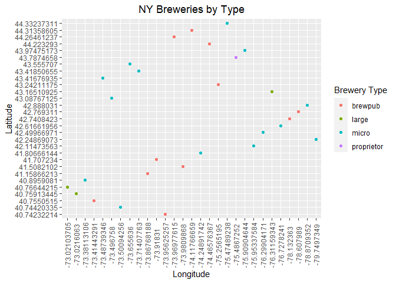
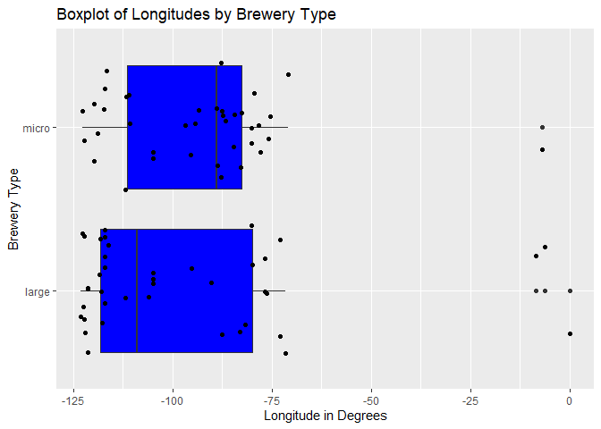
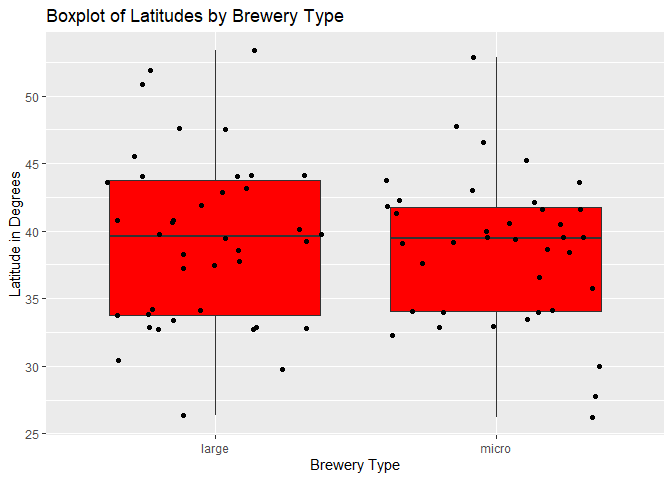
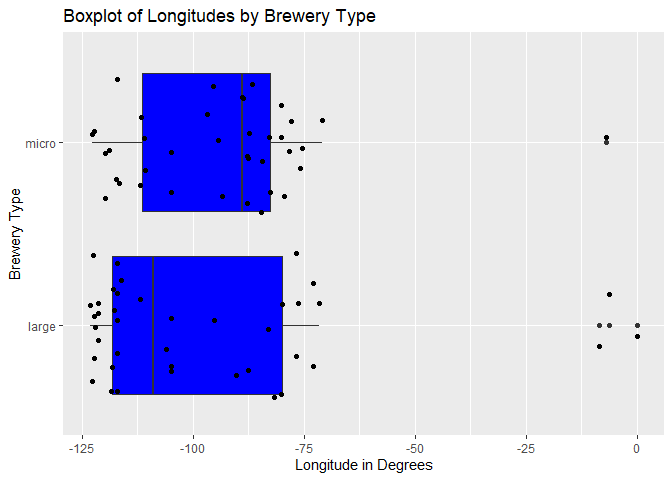

Project 2
================
Justin Feathers & Luke Perkins
2022-10-08

The purpose of this vignette is to explain how to use a function created
for interacting with a specific API, as well as demonstrate various
types of analyses that can be conducted on the data obtained from its
use. The [Beer API](https://www.openbrewerydb.org/) is a free API that
contains publicly available address and contact information for
breweries, cideries, brewpubs, and bottleshops all over the world.

# Overview

The following packages were used to create this document:

-   `knitr`: used to document code in R Markdown format  
-   `httr`: used to connect to the API  
-   `tidyverse`: used for pipe operators and plotting  
-   `jsonlite`: used for interacting with JSON in the API

## Requirements

The following packages were used to create this document:

-   `knitr`: used to document code in R Markdown format  
-   `httr`: used to connect to the API  
-   `tidyverse`: used for pipe operators and plotting  
-   `jsonlite`: used for interacting with JSON in the API

# API Function

The function we will use to query the API uses one endpoint, or
connection point between the API and server, at
<https://api.openbrewerydb.org/breweries>. Six different modifications,
each passed as separate arguments of the function, allow the user to
filter the returned API data based on any combination of single values
of the variables of interest.

``` r
get_brewery <- function(city = NULL, state = NULL, usa = TRUE, type = NULL, 
                        name = NULL, postal = NULL, latitude = NULL, 
                        longitude = NULL){
  url <- "https://api.openbrewerydb.org/breweries?per_page=50"

  if (!is.null(city)){
    if (!is.character(city)){
      stop("city must be a character string")
    }
    url <- paste0(url, "&by_city=", str_replace_all(city, " ", "_"))
  }
  
  if (!is.null(type)){
    if (!is.character(type)){
      stop("type must be a character string")
    }
    type <- tolower(type)
    type_list <- c("micro", "nano", "regional", "brewpub", "large", "planning",
                    "bar", "contract", "proprietor", "closed")
    if (!(type %in% type_list)){
    stop("type must be either micro, nano, regional, brewpub, large, planning, bar, contract, proprietor, or closed")
    }
    url <- paste0(url, "&by_type=", str_replace_all(type, " ", "_"))
  }
  
  if (!is.null(name)){
    if (!is.character(name)){
      stop("brewery must be a character string")
    }
    url <- paste0(url, "&by_name=", name)
  }
  
  if(!is.null(state)){
    if (!is.character(state)){
      stop("state must be a character string")
    }
    if (usa){
      if (nchar(state) == 2){
        state <- toupper(state)
        switch(state,
                      AL =  state <- "Alabama",
                      AK =  state <- "Alaska",
                      AZ =  state <- "Arizona",
                      AR =  state <- "Arkansas",
                      CA =  state <- "California",
                      CO =  state <- "Colorado",
                      CT =  state <- "Connecticut",
                      DE =  state <- "Delaware",
                      DC =  state <- "District_of_Columbia",
                      FL =  state <- "Florida",
                      GA =  state <- "Georgia",
                      HI =  state <- "Hawaii",
                      ID =  state <- "Idaho",
                      IL =  state <- "Illinois",
                      IN =  state <- "Indiana",
                      IA =  state <- "Iowa",
                      KS =  state <- "Kansas",
                      KY =  state <- "Kentucky",
                      LA =  state <- "Louisiana",
                      ME =  state <- "Maine",
                      MD =  state <- "Maryland",
                      MA =  state <- "Massachusetts",
                      MI =  state <- "Michigan",
                      MN =  state <- "Minnesota",
                      MS =  state <- "Mississippi",
                      MO =  state <- "Missouri",
                      MT =  state <- "Montana",
                      NE =  state <- "Nebraska",
                      NV =  state <- "Nevada",
                      NH =  state <- "New_Hampshire",
                      NJ =  state <- "New_Jersey",
                      NM =  state <- "New_Mexico",
                      NY =  state <- "New_York",
                      NC =  state <- "North_Carolina",
                      ND =  state <- "North_Dakota",
                      OH =  state <- "Ohio",
                      OK =  state <- "Oklahoma",
                      OR =  state <- "Oregon",
                      PA =  state <- "Pennsylvania",
                      PR =  state <- "Puerto_Rico",
                      RI =  state <- "Rhode_Island",
                      SC =  state <- "South_Carolina",
                      SD =  state <- "South_Dakota",
                      TN =  state <- "Tennessee",
                      TX =  state <- "Texas",
                      UT =  state <- "Utah",
                      VT =  state <- "Vermont",
                      VA =  state <- "Virginia",
                      WA =  state <- "Washington",
                      WV =  state <- "West_Virginia",
                      WI =  state <- "Wisconsin",
                      WY =  state <- "Wyoming",
                      stop("usa state must be a 2 character abbreviation or name")
               )
      }
    }
    url <- paste0(url, "&by_state=", state)
  }
  
  if (!is.null(postal)){
    if ((!is.character(postal)) | 
        ((nchar(postal) != 5) & 
         (nchar(postal) != 10))){
      stop("Postal code must be a 5 or 10 character string in the form \"12345-6789\" or \"12345\"")
    }
    url <- paste0(url, "&by_postal=", postal)
  }
  
  if ((!is.null(latitude)) & (!is.null(longitude))){
    if ((!is.numeric(latitude)) | (!is.numeric(longitude))){
      stop("Latitude and longitude must be numeric values")
    }
    url <- paste0(url, "&by_dist=", latitude, ",", longitude)
  }

  df <- fromJSON(rawToChar(GET(url)$content))
  if (length(df) == 0 ){
    message("No results found. Try different parameters")
  }
  else {
    return(df)
  }
}
```

# Exploratory Data Analysis

Now that we can access the endpoint with up to six different
modifications, we can get some data to analyze. Let’s start by grabbing
some data without any modifications using `get_brewery()`

``` r
noMod <- get_brewery()
```

Given that most of the results are from the U.S., it seems reasonable to
assume we should land somewhere in Kansas (the center of the U.S.) using
the means of the latitudes and longitudes if the results from the call
are representative – that is, they are unbiased and evenly spread. We
started by taking the unmodified data and subsetting it by selecting
only the `name`, `city`, `state`, `latitude`, and `longitude` variables.
Really, the only necessary variables to perform the calculations are
`latitude` and `longitude`, but the others provide nice labels for
understanding the locations of the breweries. From there, we used
`mutate()` to add new variables to our dataset that find the means for
both `latitude` and `longitude`, being careful to set them as numeric
variables and ignoring `NA` values to ensure the calculation would work.
Finally, we created a `distFromMean` variable using the familiar
distance formula d = sqrt\[(x<sub>2</sub> - x<sub>1</sub>)<sup>2</sup> +
(y<sub>2</sub> - y<sub>1</sub>)<sup>2</sup>\]

``` r
usDist <- noMod %>%
  select(name, city, state, latitude, longitude) %>%
  mutate(meanLat = mean(as.numeric(latitude), na.rm = TRUE), 
         meanLong = mean(as.numeric(longitude), na.rm = TRUE),
         distFromMean = sqrt(((as.numeric(latitude) - meanLat)^2) +
           ((as.numeric(longitude)- meanLong)^2)))
usDist
```

    ##                                             name                  city          state           latitude
    ## 1                          10-56 Brewing Company                  Knox        Indiana          41.289715
    ## 2                           10 Barrel Brewing Co                  Bend         Oregon  44.08683530625218
    ## 3                           10 Barrel Brewing Co                  Bend         Oregon 44.057564901366796
    ## 4                10 Barrel Brewing Co - Bend Pub                  Bend         Oregon         44.0912109
    ## 5                   10 Barrel Brewing Co - Boise                 Boise          Idaho          43.618516
    ## 6                  10 Barrel Brewing Co - Denver                Denver       Colorado         39.7592508
    ## 7                           10 Barrel Brewing Co              Portland         Oregon         45.5259786
    ## 8                           10 Barrel Brewing Co             San Diego     California          32.714813
    ## 9                 10 Torr Distilling and Brewing                  Reno         Nevada         39.5171702
    ## 10                                   101 Brewery              Quilcene     Washington 47.823475773720666
    ## 11                     101 North Brewing Company              Petaluma     California 38.270293813150886
    ## 12                           105 West Brewing Co           Castle Rock       Colorado        39.38269495
    ## 13                                   10K Brewing                 Anoka      Minnesota        45.19812039
    ## 14                 10th District Brewing Company              Abington  Massachusetts        42.10591754
    ## 15                      11 Below Brewing Company               Houston          Texas         29.9515464
    ## 16                               1188 Brewing Co              John Day         Oregon         44.4146563
    ## 17                      12 Acres Brewing Company             Killeshin           <NA>        52.84930763
    ## 18                      12 Gates Brewing Company         Williamsville       New York               <NA>
    ## 19                       12 West Brewing Company               Gilbert        Arizona               <NA>
    ## 20 12 West Brewing Company - Production Facility                  Mesa        Arizona          33.436188
    ## 21                           122 West Brewing Co            Bellingham     Washington         48.7621709
    ## 22                                   127 Brewing               Jackson       Michigan        42.28667212
    ## 23                              12Degree Brewing            Louisville       Colorado         39.9782443
    ## 24                          12welve Eyes Brewing            Saint Paul      Minnesota               <NA>
    ## 25                              13 Below Brewery            Cincinnati           Ohio        39.12639764
    ## 26                            13 Stripes Brewery               Taylors South Carolina               <NA>
    ## 27                         13 Virtues Brewing Co              Portland         Oregon         45.4762536
    ## 28                                    1323 R & D               Raleigh North Carolina               <NA>
    ## 29                    14 Cannons Brewing Company      Westlake Village     California           34.15334
    ## 30                              14 Lakes Brewery             Crosslake      Minnesota               <NA>
    ## 31                          14er Brewing Company                Denver       Colorado         39.7614112
    ## 32                             14th Star Brewing          Saint Albans        Vermont               <NA>
    ## 33                               16 Lots Brewing                 Mason           Ohio         39.3545967
    ## 34                            16 Mile Brewing Co            Georgetown       Delaware         38.6788938
    ## 35                              16 Stone Brewpub        Holland Patent       New York        43.24211175
    ## 36                          1623 Brewing CO, llc          Westminister       Maryland               <NA>
    ## 37                         1718 Ocracoke Brewing              Ocracoke North Carolina        35.10715368
    ## 38                          1781 Brewing Company          Spotsylvania       Virginia               <NA>
    ## 39                                180 and Tapped            Coraopolis   Pennsylvania        40.50984957
    ## 40                                  1817 Brewery               okolona    Mississippi          34.001703
    ## 41                          1840 Brewing Company             Milwaukee      Wisconsin        43.00436242
    ## 42                          1850 Brewing Company              Mariposa     California          37.570148
    ## 43                           18th Street Brewery                  Gary        Indiana        41.59928343
    ## 44                           18th Street Brewery               Hammond        Indiana        41.61556796
    ## 45                          1905 Brewing Company            Assumption       Illinois         39.5172564
    ## 46                                  1912 Brewing                Tucson        Arizona        32.24673727
    ## 47                                   192 Brewing               Kenmore     Washington        47.75670075
    ## 48                        1940's Brewing Company              Holbrook       New York               <NA>
    ## 49                       1st Republic Brewing Co        Essex Junction        Vermont               <NA>
    ## 50                              2 Basset Brewery White Sulphur Springs        Montana        46.54807609
    ##              longitude  meanLat  meanLong distFromMean
    ## 1           -86.627954 40.98436 -100.4575    13.832900
    ## 2  -121.28170597038259 40.98436 -100.4575    21.054063
    ## 3  -121.32880209261799 40.98436 -100.4575    21.096362
    ## 4         -121.2809536 40.98436 -100.4575    21.053964
    ## 5          -116.202929 40.98436 -100.4575    15.964267
    ## 6         -104.9853655 40.98436 -100.4575     4.690695
    ## 7         -122.6855056 40.98436 -100.4575    22.687248
    ## 8          -117.129593 40.98436 -100.4575    18.610339
    ## 9         -119.7732015 40.98436 -100.4575    19.371361
    ## 10 -122.87558226136872 40.98436 -100.4575    23.438101
    ## 11 -122.66505504468803 40.98436 -100.4575    22.372805
    ## 12        -104.8667206 40.98436 -100.4575     4.691131
    ## 13        -93.38952559 40.98436 -100.4575     8.228717
    ## 14        -70.94594149 40.98436 -100.4575    29.532846
    ## 15         -95.5186591 40.98436 -100.4575    12.087806
    ## 16        -118.9218754 40.98436 -100.4575    18.780327
    ## 17        -6.979343891 40.98436 -100.4575    94.228125
    ## 18                <NA> 40.98436 -100.4575           NA
    ## 19                <NA> 40.98436 -100.4575           NA
    ## 20        -111.5860662 40.98436 -100.4575    13.446944
    ## 21         -122.485982 40.98436 -100.4575    23.361272
    ## 22        -84.43116792 40.98436 -100.4575    16.079142
    ## 23        -105.1319826 40.98436 -100.4575     4.781550
    ## 24                <NA> 40.98436 -100.4575           NA
    ## 25        -84.70634815 40.98436 -100.4575    15.860338
    ## 26                <NA> 40.98436 -100.4575           NA
    ## 27        -122.6487531 40.98436 -100.4575    22.641323
    ## 28                <NA> 40.98436 -100.4575           NA
    ## 29         -118.802397 40.98436 -100.4575    19.575463
    ## 30                <NA> 40.98436 -100.4575           NA
    ## 31        -104.9839636 40.98436 -100.4575     4.688777
    ## 32                <NA> 40.98436 -100.4575           NA
    ## 33         -84.3183801 40.98436 -100.4575    16.221184
    ## 34        -75.37816436 40.98436 -100.4575    25.185064
    ## 35         -75.2565195 40.98436 -100.4575    25.301898
    ## 36                <NA> 40.98436 -100.4575           NA
    ## 37        -75.97176063 40.98436 -100.4575    25.181188
    ## 38                <NA> 40.98436 -100.4575           NA
    ## 39        -80.15020356 40.98436 -100.4575    20.312823
    ## 40          -88.750264 40.98436 -100.4575    13.631454
    ## 41        -87.90606942 40.98436 -100.4575    12.712922
    ## 42        -119.9036592 40.98436 -100.4575    19.743622
    ## 43        -87.26887786 40.98436 -100.4575    13.202933
    ## 44          -87.517422 40.98436 -100.4575    12.955447
    ## 45         -89.0503635 40.98436 -100.4575    11.501078
    ## 46        -110.9927505 40.98436 -100.4575    13.687146
    ## 47        -122.2415652 40.98436 -100.4575    22.812513
    ## 48                <NA> 40.98436 -100.4575           NA
    ## 49                <NA> 40.98436 -100.4575           NA
    ## 50        -110.9004865 40.98436 -100.4575    11.832633

How did we do? We can do another call using
`get_brewery(state = "kansas")` to check. Because we’re only doing a
quick check against the `latitude` and `longitude` values, we’re not
concerned with grabbing the other variables this time. We can compare
`meanLat` and `meanLong` with the latitude and longitude values from
breweries located in Kansas. As a side note, this API allows for
searching by partial match, so calling `get_brewery(state = "kansas")`
returns results for both Kansas and Arkansas.

``` r
get_brewery(state = "kansas") %>%
  select(latitude, longitude)
```

    ##       latitude    longitude
    ## 1   38.9429674 -95.28093353
    ## 2  37.68455054 -97.35071131
    ## 3   36.1297079  -94.1372796
    ## 4  37.69517328 -97.44431468
    ## 5    38.639049   -98.667933
    ## 6   36.3168272  -94.1178372
    ## 7    36.364069   -94.200584
    ## 8         <NA>         <NA>
    ## 9   39.0002602  -95.6846745
    ## 10 34.73235496 -92.25366807
    ## 11 38.84100296   -97.608998
    ## 12 38.98568748 -94.66993927
    ## 13        <NA>         <NA>
    ## 14 36.03163581 -90.52047972
    ## 15        <NA>         <NA>
    ## 16   34.752616   -92.366648
    ## 17        <NA>         <NA>
    ## 18  37.6846165  -97.3184245
    ## 19  36.0771652 -94.16886854
    ## 20        <NA>         <NA>
    ## 21        <NA>         <NA>
    ## 22        <NA>         <NA>
    ## 23 36.05959704 -94.16087539
    ## 24  34.7475388  -92.2653101
    ## 25        <NA>         <NA>
    ## 26 34.75942775 -92.27268921
    ## 27   37.754632  -100.020307
    ## 28  36.0625843  -94.1574328
    ## 29        <NA>         <NA>
    ## 30        <NA>         <NA>
    ## 31   35.310777   -94.298483
    ## 32  36.0879053 -94.16478287
    ## 33        <NA>         <NA>
    ## 34 38.97243469 -95.23580916
    ## 35 38.94967284 -95.22586264
    ## 36 38.87174492 -99.32909033
    ## 37  36.4000796  -93.7392419
    ## 38  39.1233376  -94.8239539
    ## 39 38.91268389 -94.75995296
    ## 40        <NA>         <NA>
    ## 41 39.31683651 -94.91052465
    ## 42 37.62820924  -97.7812689
    ## 43 39.01466361  -95.7637047
    ## 44  36.3320197  -94.1185366
    ## 45  36.0666309 -94.16524371
    ## 46  37.6860464  -97.3335112
    ## 47 36.11719055 -94.15714342
    ## 48        <NA>         <NA>
    ## 49 39.81655418  -97.0511838
    ## 50  38.9683511  -95.2285539

We were close, but not quite what we were hoping for. Some knowledge of
geography lets us know we are just slightly north into the bordering
state of Nebraska. But, we can also perform another call using
`get_brewery(state = "nebraska")` to verify.

``` r
get_brewery(state = "nebraska") %>%
  select(latitude, longitude)
```

    ##       latitude    longitude
    ## 1         <NA>         <NA>
    ## 2         <NA>         <NA>
    ## 3  41.28489756 -96.00634511
    ## 4  40.77999602 -96.70701376
    ## 5         <NA>         <NA>
    ## 6  42.87204733 -100.5457277
    ## 7         <NA>         <NA>
    ## 8  40.90629564 -97.09777551
    ## 9         <NA>         <NA>
    ## 10 41.25449082 -95.93090524
    ## 11 42.53141502 -98.97836727
    ## 12  40.8123075 -96.69344422
    ## 13        <NA>         <NA>
    ## 14   42.032539   -97.466386
    ## 15  40.8155873  -96.7105429
    ## 16 40.43061571 -98.10588657
    ## 17  41.2578153 -95.96580178
    ## 18  40.5844989  -98.3877198
    ## 19        <NA>         <NA>
    ## 20 41.42940061  -97.3621271
    ## 21   41.268008   -96.071539
    ## 22  40.8135885  -96.6872327
    ## 23 40.81481116 -96.69768022
    ## 24        <NA>         <NA>
    ## 25        <NA>         <NA>
    ## 26   41.284907   -96.007724
    ## 27  41.2077948  -96.0980711
    ## 28 41.23283768 -96.08239397
    ## 29        <NA>         <NA>
    ## 30  42.2294276  -97.0191502
    ## 31        <NA>         <NA>
    ## 32        <NA>         <NA>
    ## 33        <NA>         <NA>
    ## 34 40.81497373 -96.71088449
    ## 35        <NA>         <NA>
    ## 36        <NA>         <NA>
    ## 37  40.4368517 -99.37228235
    ## 38        <NA>         <NA>
    ## 39        <NA>         <NA>
    ## 40        <NA>         <NA>
    ## 41  41.1772046  -96.0813295
    ## 42        <NA>         <NA>
    ## 43    41.12294 -100.7916041
    ## 44        <NA>         <NA>
    ## 45 40.92675443 -98.34025786
    ## 46        <NA>         <NA>
    ## 47        <NA>         <NA>
    ## 48 41.60253006 -98.92940309
    ## 49        <NA>         <NA>
    ## 50        <NA>         <NA>

We can see that these values more closely align with the means we found.
So what happened? If we look back at `usDist`, we can see one glaring
outlier from Killeshin, Ireland. Let’s remove that and see if our
results are better. Because the mean values in `usDist` were calculated
using all observations, we need to remember to start over with the
unmodified data `noMod`. Again, we select all variables of interest with
`select()`, but this time we can use a `filter()` function to select
observations where `city` does not equal “Killeshin.” Then, we simply
calculate the means as before with the subsetted data.

``` r
noMod %>%
  select(name, city, state, latitude, longitude) %>%
  filter(city != "Killeshin") %>%
  mutate(meanLat = mean(as.numeric(latitude), na.rm = TRUE), 
         meanLong = mean(as.numeric(longitude), na.rm = TRUE),
         distFromMean = sqrt(((as.numeric(latitude) - meanLat)^2) +
           ((as.numeric(longitude)- meanLong)^2))) %>%
  arrange(state)
```

    ##                                             name                  city          state           latitude
    ## 1                        12 West Brewing Company               Gilbert        Arizona               <NA>
    ## 2  12 West Brewing Company - Production Facility                  Mesa        Arizona          33.436188
    ## 3                                   1912 Brewing                Tucson        Arizona        32.24673727
    ## 4                           10 Barrel Brewing Co             San Diego     California          32.714813
    ## 5                      101 North Brewing Company              Petaluma     California 38.270293813150886
    ## 6                     14 Cannons Brewing Company      Westlake Village     California           34.15334
    ## 7                           1850 Brewing Company              Mariposa     California          37.570148
    ## 8                  10 Barrel Brewing Co - Denver                Denver       Colorado         39.7592508
    ## 9                            105 West Brewing Co           Castle Rock       Colorado        39.38269495
    ## 10                              12Degree Brewing            Louisville       Colorado         39.9782443
    ## 11                          14er Brewing Company                Denver       Colorado         39.7614112
    ## 12                            16 Mile Brewing Co            Georgetown       Delaware         38.6788938
    ## 13                  10 Barrel Brewing Co - Boise                 Boise          Idaho          43.618516
    ## 14                          1905 Brewing Company            Assumption       Illinois         39.5172564
    ## 15                         10-56 Brewing Company                  Knox        Indiana          41.289715
    ## 16                           18th Street Brewery                  Gary        Indiana        41.59928343
    ## 17                           18th Street Brewery               Hammond        Indiana        41.61556796
    ## 18                          1623 Brewing CO, llc          Westminister       Maryland               <NA>
    ## 19                 10th District Brewing Company              Abington  Massachusetts        42.10591754
    ## 20                                   127 Brewing               Jackson       Michigan        42.28667212
    ## 21                                   10K Brewing                 Anoka      Minnesota        45.19812039
    ## 22                          12welve Eyes Brewing            Saint Paul      Minnesota               <NA>
    ## 23                              14 Lakes Brewery             Crosslake      Minnesota               <NA>
    ## 24                                  1817 Brewery               okolona    Mississippi          34.001703
    ## 25                              2 Basset Brewery White Sulphur Springs        Montana        46.54807609
    ## 26                10 Torr Distilling and Brewing                  Reno         Nevada         39.5171702
    ## 27                      12 Gates Brewing Company         Williamsville       New York               <NA>
    ## 28                              16 Stone Brewpub        Holland Patent       New York        43.24211175
    ## 29                        1940's Brewing Company              Holbrook       New York               <NA>
    ## 30                                    1323 R & D               Raleigh North Carolina               <NA>
    ## 31                         1718 Ocracoke Brewing              Ocracoke North Carolina        35.10715368
    ## 32                              13 Below Brewery            Cincinnati           Ohio        39.12639764
    ## 33                               16 Lots Brewing                 Mason           Ohio         39.3545967
    ## 34                          10 Barrel Brewing Co                  Bend         Oregon  44.08683530625218
    ## 35                          10 Barrel Brewing Co                  Bend         Oregon 44.057564901366796
    ## 36               10 Barrel Brewing Co - Bend Pub                  Bend         Oregon         44.0912109
    ## 37                          10 Barrel Brewing Co              Portland         Oregon         45.5259786
    ## 38                               1188 Brewing Co              John Day         Oregon         44.4146563
    ## 39                         13 Virtues Brewing Co              Portland         Oregon         45.4762536
    ## 40                                180 and Tapped            Coraopolis   Pennsylvania        40.50984957
    ## 41                            13 Stripes Brewery               Taylors South Carolina               <NA>
    ## 42                      11 Below Brewing Company               Houston          Texas         29.9515464
    ## 43                             14th Star Brewing          Saint Albans        Vermont               <NA>
    ## 44                       1st Republic Brewing Co        Essex Junction        Vermont               <NA>
    ## 45                          1781 Brewing Company          Spotsylvania       Virginia               <NA>
    ## 46                                   101 Brewery              Quilcene     Washington 47.823475773720666
    ## 47                           122 West Brewing Co            Bellingham     Washington         48.7621709
    ## 48                                   192 Brewing               Kenmore     Washington        47.75670075
    ## 49                          1840 Brewing Company             Milwaukee      Wisconsin        43.00436242
    ##              longitude  meanLat  meanLong distFromMean
    ## 1                 <NA> 40.67213 -102.9174           NA
    ## 2         -111.5860662 40.67213 -102.9174    11.291767
    ## 3         -110.9927505 40.67213 -102.9174    11.670387
    ## 4          -117.129593 40.67213 -102.9174    16.288165
    ## 5  -122.66505504468803 40.67213 -102.9174    19.893148
    ## 6          -118.802397 40.67213 -102.9174    17.170516
    ## 7         -119.9036592 40.67213 -102.9174    17.267140
    ## 8         -104.9853655 40.67213 -102.9174     2.260461
    ## 9         -104.8667206 40.67213 -102.9174     2.337168
    ## 10        -105.1319826 40.67213 -102.9174     2.320711
    ## 11        -104.9839636 40.67213 -102.9174     2.258306
    ## 12        -75.37816436 40.67213 -102.9174    27.611309
    ## 13         -116.202929 40.67213 -102.9174    13.608290
    ## 14         -89.0503635 40.67213 -102.9174    13.915078
    ## 15          -86.627954 40.67213 -102.9174    16.301184
    ## 16        -87.26887786 40.67213 -102.9174    15.675999
    ## 17          -87.517422 40.67213 -102.9174    15.428884
    ## 18                <NA> 40.67213 -102.9174           NA
    ## 19        -70.94594149 40.67213 -102.9174    32.003627
    ## 20        -84.43116792 40.67213 -102.9174    18.556638
    ## 21        -93.38952559 40.67213 -102.9174    10.548254
    ## 22                <NA> 40.67213 -102.9174           NA
    ## 23                <NA> 40.67213 -102.9174           NA
    ## 24          -88.750264 40.67213 -102.9174    15.658969
    ## 25        -110.9004865 40.67213 -102.9174     9.912410
    ## 26        -119.7732015 40.67213 -102.9174    16.895289
    ## 27                <NA> 40.67213 -102.9174           NA
    ## 28         -75.2565195 40.67213 -102.9174    27.780048
    ## 29                <NA> 40.67213 -102.9174           NA
    ## 30                <NA> 40.67213 -102.9174           NA
    ## 31        -75.97176063 40.67213 -102.9174    27.514329
    ## 32        -84.70634815 40.67213 -102.9174    18.276568
    ## 33         -84.3183801 40.67213 -102.9174    18.645662
    ## 34 -121.28170597038259 40.67213 -102.9174    18.679044
    ## 35 -121.32880209261799 40.67213 -102.9174    18.720033
    ## 36        -121.2809536 40.67213 -102.9174    18.679105
    ## 37        -122.6855056 40.67213 -102.9174    20.355257
    ## 38        -118.9218754 40.67213 -102.9174    16.436199
    ## 39        -122.6487531 40.67213 -102.9174    20.307746
    ## 40        -80.15020356 40.67213 -102.9174    22.767809
    ## 41                <NA> 40.67213 -102.9174           NA
    ## 42         -95.5186591 40.67213 -102.9174    13.025850
    ## 43                <NA> 40.67213 -102.9174           NA
    ## 44                <NA> 40.67213 -102.9174           NA
    ## 45                <NA> 40.67213 -102.9174           NA
    ## 46 -122.87558226136872 40.67213 -102.9174    21.200694
    ## 47         -122.485982 40.67213 -102.9174    21.174910
    ## 48        -122.2415652 40.67213 -102.9174    20.581865
    ## 49        -87.90606942 40.67213 -102.9174    15.191458

Now we are a bit further away than expected, so it appears that although
close, this data is not quite representative or unbiased. Visual
inspection of the tibble shows us that 6 results are from Oregon, with
California and Colorado having 4 each; it seems reasonable to assume
this is why our means are northwest of where we expected.

A visual representation can help solidify our findings. We can use a
histogram for this. We started by creating a base plot object `g` using
`ggplot()` with `usDist` as the input and using an `aes()` statement to
set the x-value to `distFromMean` by default. Then we used
`geom_histogram()` to create the actual histogram layer and setting the
outline color of the bars to blue and filling the bars with white.
Finally, a `labs()` statement was used to name the axes and title and
the `theme()` statement was used to center the title.

Here, the histogram includes the brewery from Ireland. Though clearly
skewed right, it looks like it could be considered nearly
normally-distributed without the outlier. The x-axis shows us the
distance from the mean and each bar’s height represents the frequency
that breweries were that corresponding distance from the mean.

``` r
g <- ggplot(usDist, aes(x = distFromMean))
g + geom_histogram(color = 4, fill = "white") +
  labs(title = "Distance of Brewery from Mean", x = "Distance", y = "Count") +
  theme(plot.title = element_text(hjust = 0.5))
```

<!-- -->

Here is the histogram without the brewery from Ireland. Notice we used
`na.omit()` to omit the `NA` values that showed up for `latitude` and
`longitude` (which can’t be properly plotted anyway), but because
“Killeshin” is the only city outside of the U.S., it was a convenient
way to exclude it from the data. Without the outlier, the plot shows a
lot of gaps. Because this is representing continuous data, we felt it
was appropriate to experiment with `binwidth =` and `bins =` to minimize
the gaps. Ultimately, we settled on `bins = 10`, while keeping the
color, fill, and labels the same as before.

As with the previous plot, this histogram looks nearly
normally-distributed. This indicates that it is nearly representative of
the population. Still, it is important to note that we couldn’t make
assumptions about the population with this data. As with the above
histogram, the x-axis is the distance from the mean and the y-axis
consists of the corresponding frequencies of breweries’ distances from
the mean.

``` r
g <- ggplot(na.omit(usDist), aes(x = distFromMean))
g + geom_histogram(color = 4, fill = "white", bins = 10) +
  labs(title = "Distance of Brewery from Mean", x = "Distance", y = "Count") +
  theme(plot.title = element_text(hjust = 0.5))
```

<!-- -->

Next, let’s look at some more specific data by calling the function
`get_brewery(state = "ny")` to get brewery data for the state of New
York.

``` r
#Get brewery data for NY
ny <- get_brewery(state = "ny")
```

We want to see if there are any patterns by type of brewery. To do this,
we will investigate latitude and longitude values across brewery types.
Additionally, we may want to look at the means of each type to see if
they have significant variance.

We started by creating a new object called `nyDist` that uses the
modified `ny` dataset and selects the `name`, `brewery_type`,
`latitude`, and `longitude` variables. Because we’re interested in
whether patterns exist by brewery type, we used `group_by(brewery_type)`
to group the data by `brewery_type` and perform separate calculations
per level of the groups. We used `mutate()` again to add columns for
newly calculated `meanLat` and `meanLong`; again we had to remember to
set the variables to numeric using `as.numeric` and being careful to
ignore `NA` values by setting `na.rm = TRUE`. Finally, we used the
`arrange()` function to arrange the data by our newly created variable.

``` r
nyDist <- ny %>% 
  select(name, brewery_type, latitude, longitude) %>%
  group_by(brewery_type) %>%
  mutate(meanLat = mean(as.numeric(latitude), na.rm = TRUE), 
         meanLong = mean(as.numeric(longitude), na.rm = TRUE)) %>%
  arrange(meanLat)
nyDist
```

    ## # A tibble: 50 x 6
    ## # Groups:   brewery_type [6]
    ##    name                                    brewery_type latitude    longitude    meanLat meanLong
    ##    <chr>                                   <chr>        <chr>       <chr>          <dbl>    <dbl>
    ##  1 Anheuser-Busch Inc – Baldwinsville large        43.16510925 -76.31159343    41.6    -74.1
    ##  2 Blue Point Brewing Co                   large        40.75913445 -73.0216063     41.6    -74.1
    ##  3 Blue Point Brewing                      large        40.76644215 -73.02103705    41.6    -74.1
    ##  4 12 Gates Brewing Company                brewpub      <NA>        <NA>            42.5    -74.9
    ##  5 16 Stone Brewpub                        brewpub      43.24211175 -75.2565195     42.5    -74.9
    ##  6 2 Way Brewing Company                   brewpub      41.5082102  -73.9809868     42.5    -74.9
    ##  7 42 North Brewing Company                brewpub      42.769311   -78.607989      42.5    -74.9
    ##  8 6 Degrees of Separation                 brewpub      41.15866213 -73.86768188    42.5    -74.9
    ##  9 Alewife Brewing Company                 brewpub      40.74232214 -73.95625257    42.5    -74.9
    ## 10 Amber Lantern Brewing Company           brewpub      42.7408423  -78.132363      42.5    -74.9
    ## # ... with 40 more rows

Now that we have the data, let’s create a scatter plot to look for
obvious patterns. As before, we created a base `g` object using
`ggplot()` and we used `na.omit()` again – this time to make sure `NA`
doesn’t show up on the y-axis. This time we added a `y =` to the `aes()`
statement since a scatter plot needs a variable on both axes. We used a
`geom_point()` layer to create the actual scatter plot and specified
`color = brewery_type` in the `aes()` statement to display breweries by
type using different colors (and automatically creating a nice legend).
As before, a `labs()` layer was used to name the axes and give the plot
a title. The first `theme()` layer was used to rotate the x-axis 90
degrees so the longitude values could be legible, while the second
`theme()` layer was used to center the title.

``` r
g <- ggplot(na.omit(nyDist), aes(x = longitude, y = latitude))
g + geom_point(aes(color = brewery_type)) +
    labs(color = "Brewery Type", x = "Longitude", y = "Latitude") +
    theme(axis.text.x = element_text(angle = 90, vjust = 0.5)) +
    labs(title = "NY Breweries by Type", hjust = 0.5) +
    theme(plot.title = element_text(hjust = 0.5))
```

<!-- -->

As the labels would suggest, this plots the longitude vs. latitude of
each brewery in our dataset. Looking at the plot, there doesn’t appear
to be any sort of obvious pattern that would suggest a preference of
location to build a brewery, but there are clusters or groups of
breweries by type. We believe this suggests the influence of
competition.

Finally, let’s look at a breakdown of some summary statistics for this
numerical data at each setting of the `brewery_type` variable. To do
this, we used the same `nyDist` dataset in conjunction with the
`summarize()` function to print a tibble of `meanLat`, `meanLong`, along
with `sdLat` and `sdLong` that we created using the built-in `sd()`
function. Like in previous calculations, it was important to set
`latitude` and `longitude` as numeric values using `as.numeric()` and
omitting `NA` values from the calculations using `na.rm = TRUE`.

The values of `meanLat` and `meanLong` are very similar across all
categories of `brewery_type`. We believe this suggests an even
spattering of types across all available locations – this could be
understood to indicate that no major confounders exist that dictate
where a type of brewery may be established.

``` r
nyDist %>%
  summarize(meanLat = mean(as.numeric(latitude), na.rm = TRUE), 
            meanLong = mean(as.numeric(longitude), na.rm = TRUE),
            sdLat = sd(latitude, na.rm = TRUE), sdLong = sd(longitude, na.rm = TRUE))
```

    ## # A tibble: 6 x 5
    ##   brewery_type meanLat meanLong sdLat sdLong
    ##   <chr>          <dbl>    <dbl> <dbl>  <dbl>
    ## 1 brewpub         42.5    -74.9  1.40   1.79
    ## 2 contract       NaN      NaN   NA     NA   
    ## 3 large           41.6    -74.1  1.39   1.90
    ## 4 micro           42.7    -75.3  1.06   2.08
    ## 5 planning       NaN      NaN   NA     NA   
    ## 6 proprietor      43.8    -75.5 NA     NA

Derive Region variable from state, make contingency tables, create bar
graph.

``` r
brew <- get_brewery()

brew_reg <- brew %>%
  mutate(Region = 
    if_else(brew$state %in%
    c("Connecticut", "Maine", "Massachusetts", "New Hampshire", "Rhode Island", 
      "Vermont", "New Jersey", "New York", "Pennsylvania"),
    "Northeast",
    if_else(brew$state %in%
    c("Illinois", "Indiana", "Michigan", "Ohio", "Wisconsin", "Iowa", "Kansas", 
      "Minnesota", "Missouri", "Nebraska", "North Dakota", "South Dakota"),
    "Midwest",
    if_else(brew$state %in%
    c("Delaware", "Florida", "Georgia", "Maryland", "North Carolina",
      "South Carolina", "Virginia", "Washington D.C.", "West Virginia", 
      "Alabama", "Kentucky", "Mississippi", "Tennessee", "Arkansas",
      "Louisiana", "Oklahoma", "Texas"),
    "South",
    if_else(brew$state %in%
    c("Arizona", "Colorado", "Idaho", "Montana", "Nevada", "New Mexico", "Utah",
      "Wyoming", "Alaska", "California","Hawaii","Oregon","Washington"),
    "West", 
    "Not US"))))) %>%
  select(id:state, Region, everything())

table(brew_reg$Region)
```

    ## 
    ##   Midwest Northeast    Not US     South      West 
    ##        11         7         1         8        23

``` r
table(brew_reg$brewery_type)
```

    ## 
    ##    brewpub     closed   contract      large      micro proprietor 
    ##          9          2          1          7         30          1

``` r
table(brew_reg$Region, brew_reg$brewery_type)
```

    ##            
    ##             brewpub closed contract large micro proprietor
    ##   Midwest         1      0        0     0    10          0
    ##   Northeast       2      0        0     0     5          0
    ##   Not US          0      0        0     0     1          0
    ##   South           2      0        1     0     5          0
    ##   West            4      2        0     7     9          1

``` r
g <- ggplot(brew_reg, aes(x = Region))
g + geom_bar(aes(fill = brewery_type)) +
    labs(x = "Geographic Region",
         y = "Number of Breweries",
         title = "Bar Plot of Breweries by US Region") + 
    scale_fill_discrete(name = "Brewery Type", 
                        labels = c("Brewpub", "Closed", "Contract", "Large",
                                   "Micro", "Proprietor")
                        )
```

<!-- -->

``` r
micro <- get_brewery(type = "micro")
large <- get_brewery(type = "large")
combined <- bind_rows(micro, large)

g <- ggplot(combined, aes(x = brewery_type, y = as.numeric(latitude)))
g + geom_boxplot(fill = "red", na.rm = TRUE) +
    geom_jitter() +
    labs(title = "Boxplot of Latitudes by Brewery Type",
         x = "Brewery Type",
         y = "Latitude in Degrees")
```

<!-- -->

``` r
g <- ggplot(combined, aes(x = brewery_type, y = as.numeric(longitude)))
g + geom_boxplot(fill = "blue", na.rm = TRUE) +
    geom_jitter() +
    coord_flip() +
    labs(title = "Boxplot of Longitudes by Brewery Type",
         x = "Brewery Type",
         y = "Longitude in Degrees")
```

<!-- -->
