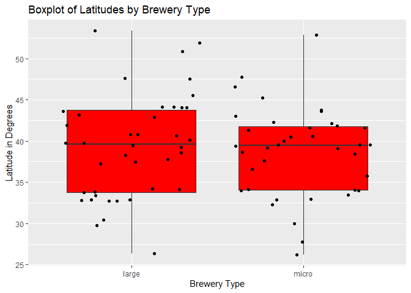

Project 2
================
Justin Feathers & Luke Perkins
2022-10-08

-   <a href="#overview" id="toc-overview">Overview</a>
    -   <a href="#requirements" id="toc-requirements">Requirements</a>
-   <a href="#api-function" id="toc-api-function">API Function</a>
    -   <a href="#general-form" id="toc-general-form">General Form</a>
    -   <a href="#detailed-explanations" id="toc-detailed-explanations">Detailed
        Explanations</a>
-   <a href="#exploratory-data-analysis"
    id="toc-exploratory-data-analysis">Exploratory Data Analysis</a>

The purpose of this vignette is to explain how to use a function created
for interacting with a specific API, as well as demonstrate various
types of analyses that can be conducted on the data obtained from its
use. The [Beer API](https://www.openbrewerydb.org/) is a free API that
contains publicly available address and contact information for
breweries, cideries, brewpubs, and bottleshops all over the world.

# Overview

The purpose of this vignette is to explain how to use a function created
for interacting with a specific API, as well as demonstrate various
types of analyses that can be conducted on the data obtained from its
use. The [Beer API](https://www.openbrewerydb.org/) is a free API that
contains publicly available address and contact information for
breweries, cideries, brewpubs, and bottleshops all over the world.

## Requirements

The following packages were used to create this document:

-   `knitr`: used to document code in R Markdown format  
-   `httr`: used to connect to the API  
-   `tidyverse`: used for pipe operators and plotting  
-   `jsonlite`: used for interacting with JSON in the API

# API Function

## General Form

The function we will use to query the API uses one endpoint, or
connection point between the API and server, at
<https://api.openbrewerydb.org/breweries>. Six different modifications,
each passed as separate arguments of the function, allow the user to
filter the returned API data based on any combination of single values
of the variables of interest.

The function takes arguments of `city`, `state`, `usa`, which is
defaulted to `TRUE`, `type`, `name`, `postal`, `latitude`, and
`longitude`. Other than `usa`, which is boolean, and `latitude` and
`longitude`, which are numeric, all arguments must be provided as
character strings. Note that character strings can be provided as
partial matches, as well, e.g., `name = "brewery"` will return records
with brewery anywhere in the name. If no arguments are specified, the
API call is run as an open query, pulling data from the entire data set.
To reduce bandwidth, the results are limited to 20 per call. This
function appends “?per_page=50” to the base url, allowing 50 results,
which is stored as the new url that each modification will append to,
and is now the function’s default result limit.

The code following the function’s setup can be divided into sections
corresponding to each argument, but they all operate similarly. The
argument is first checked with an `if` statement to see if the user
supplied a value. If so, the logic confirms that the correct data type
was used, and then adds the parameter string to the current url string,
along with the corresponding value, provided by user, potentially
modified to match the formatting needed by the API. The new url string
is then saved as the url to append future parameter strings to. After
the url has been either modified or left unchanged, the next argument is
evaluated and the cycle repeats.

After all the arguments have been evaluated, the final url is then sent
with a GET request via the `GET` function. The content portion of the
returned list is isolated via `$content` and converted from raw bytes to
character data via the `rawToChar()` function. The `fromJSON()` function
then converts that JSON structure into a data frame, which is stored as
`df`. If that data frame is empty, a message informs the user that there
were no results, otherwise, the data frame is returned.

## Detailed Explanations

Explanations for each argument section separated by line breaks are as
follows:

1.  The first argument section checks if the user provided a city via
    the `if()` function evaluating condition `!is.null(city)`. If a city
    was not provided, as is the default argument, the rest of the code
    portion is skipped. and the next argument is evaluated. If a city
    was provided, another `if` statement is evaluated to check that the
    data type is character via `!is.character(city)`. If it is not, the
    function errors and the user is informed to change the input. If it
    is character, the city parameter string, `"&by_city="` is added to
    the url, followed by the city name via `paste0()` function.
    `str_replace_all()` converts all spaces into underscores per url
    formatting, and the new url is saved. Then, the next argument is
    evaluated.  
2.  The `type` argument is evaluated to see if it is present and
    characters using the same logic as used for `city`. If those checks
    pass, the string is converted to lower case with `tolower()`. This
    is done because the allowed values of the modification string are
    lower case and case-sensitive. A vector of allowed values is saved
    to `type_list` which is then checked in an `if` statement with the
    `%in%` infix function to verify that the provided `type` can be used
    in the url. If not, an error message informs the user. If so, the
    `type` value is added to the url and modification string of
    `"&by_type="`, the url is saved, and the next argument is
    evaluated.  
3.  The `name` argument is evaluated to see if it is present and
    characters using the same logic as the previous two arguments. If
    not, an error is thrown and message sent to the user. If so, the
    `name` value is added to the url and modification string of
    `"&byname="`, the url is saved, and the next argument is
    evaluated.  
4.  The `state` argument is evaluated to see if it is present and
    characters using the same logic from before, and the same outcomes
    result. If it is present, a secondary argument `usa` is evaluated.
    If `FALSE`, the `state` name is passed and added to the url string
    using the same logic as previously outlined but with modification
    string `"&bystate="`. If `TRUE`(the default), another conditional
    statement checks if the number of characters is two, in line with
    standard two character state abbreviations, via `nchar()`. If not,
    the string is passed to the url appending code portion as before. If
    so, the state string is converted to upper case via `toupper()` and
    mapped to the full state name using a `switch()` function. If the
    value is not in the mapping, an informative error message is
    provided. The full state name or passed state name is passed to
    added to the url and modification string of `"bystate="`, the url is
    saved, and the next argument is evaluated.  
5.  The `postal` argument is evaluated to see if it is present the same
    as before. If it is, a condition is checked to see if it is either
    not in character format or does not have 5 or 10 characters, using
    an expression with `ischaracter()`, `nchar()`, the `|` function and
    the `&` function. If the expression is `FALSE`, an informative error
    prints. If the expression is true, the postal code is added to the
    url and modification string of `"&bypostal="`, the url is saved, and
    the next argument is evaluated.  
6.  The `latitude` and `longitude` arguments are evaluated to see if
    they are both present using the `&` function and similar logic as
    before. If not, the final url is passed as an argument to the `GET`
    function as described in the general form section of this document
    above. If so, the arguments are checked to confirm they are numeric.
    If not, an informative error message prints. If so, the values are
    separated by a comma and pasted to the end of the url, following the
    modification string of `"&bydist="`. The url string is saved and
    passed as the final url to the `GET` function.

``` r
get_brewery <- function(city = NULL, state = NULL, usa = TRUE, type = NULL, 
                        name = NULL, postal = NULL, latitude = NULL, 
                        longitude = NULL){
  url <- "https://api.openbrewerydb.org/breweries?per_page=50"

  if (!is.null(city)){
    if (!is.character(city)){
      stop("city must be a character string")
    }
    url <- paste0(url, "&by_city=", str_replace_all(city, " ", "_"))
  }
  
  if (!is.null(type)){
    if (!is.character(type)){
      stop("type must be a character string")
    }
    type <- tolower(type)
    type_list <- c("micro", "nano", "regional", "brewpub", "large", "planning",
                    "bar", "contract", "proprietor", "closed")
    if (!(type %in% type_list)){
    stop("type must be either micro, nano, regional, brewpub, large, planning, 
         bar, contract, proprietor, or closed")
    }
    url <- paste0(url, "&by_type=", type)
  }
  
  if (!is.null(name)){
    if (!is.character(name)){
      stop("brewery must be a character string")
    }
    url <- paste0(url, "&by_name=", name)
  }
  
  if(!is.null(state)){
    if (!is.character(state)){
      stop("state must be a character string")
    }
    if (usa){
      if (nchar(state) == 2){
        state <- toupper(state)
        switch(state,
                      AL = state <- "Alabama",
                      AK = state <- "Alaska",
                      AZ = state <- "Arizona",
                      AR = state <- "Arkansas",
                      CA = state <- "California",
                      CO = state <- "Colorado",
                      CT = state <- "Connecticut",
                      DE = state <- "Delaware",
                      DC = state <- "District_of_Columbia",
                      FL = state <- "Florida",
                      GA = state <- "Georgia",
                      HI = state <- "Hawaii",
                      ID = state <- "Idaho",
                      IL = state <- "Illinois",
                      IN = state <- "Indiana",
                      IA = state <- "Iowa",
                      KS = state <- "Kansas",
                      KY = state <- "Kentucky",
                      LA = state <- "Louisiana",
                      ME = state <- "Maine",
                      MD = state <- "Maryland",
                      MA = state <- "Massachusetts",
                      MI = state <- "Michigan",
                      MN = state <- "Minnesota",
                      MS = state <- "Mississippi",
                      MO = state <- "Missouri",
                      MT = state <- "Montana",
                      NE = state <- "Nebraska",
                      NV = state <- "Nevada",
                      NH = state <- "New_Hampshire",
                      NJ = state <- "New_Jersey",
                      NM = state <- "New_Mexico",
                      NY = state <- "New_York",
                      NC = state <- "North_Carolina",
                      ND = state <- "North_Dakota",
                      OH = state <- "Ohio",
                      OK = state <- "Oklahoma",
                      OR = state <- "Oregon",
                      PA = state <- "Pennsylvania",
                      PR = state <- "Puerto_Rico",
                      RI = state <- "Rhode_Island",
                      SC = state <- "South_Carolina",
                      SD = state <- "South_Dakota",
                      TN = state <- "Tennessee",
                      TX = state <- "Texas",
                      UT = state <- "Utah",
                      VT = state <- "Vermont",
                      VA = state <- "Virginia",
                      WA = state <- "Washington",
                      WV = state <- "West_Virginia",
                      WI = state <- "Wisconsin",
                      WY = state <- "Wyoming",
                      stop("usa state must be a 2 character abbreviation 
                           or name")
               )
      }
    }
    url <- paste0(url, "&by_state=", state)
  }
  
  if (!is.null(postal)){
    if ((!is.character(postal)) | 
        ((nchar(postal) != 5) & 
         (nchar(postal) != 10))){
      stop("Postal code must be a 5 or 10 character string in the 
           form \"12345-6789\" or \"12345\"")
    }
    url <- paste0(url, "&by_postal=", postal)
  }
  
  if ((!is.null(latitude)) & (!is.null(longitude))){
    if ((!is.numeric(latitude)) | (!is.numeric(longitude))){
      stop("Latitude and longitude must be numeric values")
    }
    url <- paste0(url, "&by_dist=", latitude, ",", longitude)
  }

  df <- fromJSON(rawToChar(GET(url)$content))
  if (length(df) == 0 ){
    message("No results found. Try different parameters")
  }
  else {
    return(df)
  }
}
```

# Exploratory Data Analysis

Now that we can access the endpoint with up to six different
modifications, we can get some data to analyze. Let’s start by grabbing
some data without any modifications using `get_brewery()`

``` r
noMod <- get_brewery()
```

Given that most of the results are from the U.S., it seems reasonable to
assume we should land somewhere in Kansas (the center of the U.S.) using
the means of the latitudes and longitudes if the results from the call
are representative – that is, they are unbiased and evenly spread. We
started by taking the unmodified data and subsetting it by selecting
only the `name`, `city`, `state`, `latitude`, and `longitude` variables.
Really, the only necessary variables to perform the calculations are
`latitude` and `longitude`, but the others provide nice labels for
understanding the locations of the breweries. From there, we used
`mutate()` to add new variables to our dataset that find the means for
both `latitude` and `longitude`, being careful to set them as numeric
variables and ignoring `NA` values to ensure the calculation would work.
Finally, we created a `distFromMean` variable using the familiar
distance formula d = sqrt\[(x<sub>2</sub> - x<sub>1</sub>)<sup>2</sup> +
(y<sub>2</sub> - y<sub>1</sub>)<sup>2</sup>\]

``` r
usDist <- noMod %>%
  select(name, city, state, latitude, longitude) %>%
  mutate(meanLat = mean(as.numeric(latitude), na.rm = TRUE), 
         meanLong = mean(as.numeric(longitude), na.rm = TRUE),
         distFromMean = sqrt(((as.numeric(latitude) - meanLat)^2) +
           ((as.numeric(longitude)- meanLong)^2)))
usDist
```

    ## # A tibble: 50 x 8
    ##    name                            city      state      latitude           longitude           meanLat meanLong distFromMean
    ##    <chr>                           <chr>     <chr>      <chr>              <chr>                 <dbl>    <dbl>        <dbl>
    ##  1 10-56 Brewing Company           Knox      Indiana    41.289715          -86.627954             41.0    -100.        13.8 
    ##  2 10 Barrel Brewing Co            Bend      Oregon     44.08683530625218  -121.28170597038259    41.0    -100.        21.1 
    ##  3 10 Barrel Brewing Co            Bend      Oregon     44.057564901366796 -121.32880209261799    41.0    -100.        21.1 
    ##  4 10 Barrel Brewing Co - Bend Pub Bend      Oregon     44.0912109         -121.2809536           41.0    -100.        21.1 
    ##  5 10 Barrel Brewing Co - Boise    Boise     Idaho      43.618516          -116.202929            41.0    -100.        16.0 
    ##  6 10 Barrel Brewing Co - Denver   Denver    Colorado   39.7592508         -104.9853655           41.0    -100.         4.69
    ##  7 10 Barrel Brewing Co            Portland  Oregon     45.5259786         -122.6855056           41.0    -100.        22.7 
    ##  8 10 Barrel Brewing Co            San Diego California 32.714813          -117.129593            41.0    -100.        18.6 
    ##  9 10 Torr Distilling and Brewing  Reno      Nevada     39.5171702         -119.7732015           41.0    -100.        19.4 
    ## 10 101 Brewery                     Quilcene  Washington 47.823475773720666 -122.87558226136872    41.0    -100.        23.4 
    ## # ... with 40 more rows

How did we do? We can do another call using
`get_brewery(state = "kansas")` to check. Because we’re only doing a
quick check against the `latitude` and `longitude` values, we’re not
concerned with grabbing the other variables this time. We can compare
`meanLat` and `meanLong` with the latitude and longitude values from
breweries located in Kansas. As a side note, this API allows for
searching by partial match, so calling `get_brewery(state = "kansas")`
returns results for both Kansas and Arkansas.

``` r
get_brewery(state = "kansas") %>%
  select(latitude, longitude)
```

    ## # A tibble: 50 x 2
    ##    latitude    longitude   
    ##    <chr>       <chr>       
    ##  1 38.9429674  -95.28093353
    ##  2 37.68455054 -97.35071131
    ##  3 36.1297079  -94.1372796 
    ##  4 37.69517328 -97.44431468
    ##  5 38.639049   -98.667933  
    ##  6 36.3168272  -94.1178372 
    ##  7 36.364069   -94.200584  
    ##  8 <NA>        <NA>        
    ##  9 39.0002602  -95.6846745 
    ## 10 34.73235496 -92.25366807
    ## # ... with 40 more rows

We were close, but not quite what we were hoping for. Some knowledge of
geography lets us know we are just slightly north into the bordering
state of Nebraska. But, we can also perform another call using
`get_brewery(state = "nebraska")` to verify.

``` r
get_brewery(state = "nebraska") %>%
  select(latitude, longitude)
```

    ## # A tibble: 50 x 2
    ##    latitude    longitude   
    ##    <chr>       <chr>       
    ##  1 <NA>        <NA>        
    ##  2 <NA>        <NA>        
    ##  3 41.28489756 -96.00634511
    ##  4 40.77999602 -96.70701376
    ##  5 <NA>        <NA>        
    ##  6 42.87204733 -100.5457277
    ##  7 <NA>        <NA>        
    ##  8 40.90629564 -97.09777551
    ##  9 <NA>        <NA>        
    ## 10 41.25449082 -95.93090524
    ## # ... with 40 more rows

We can see that these values more closely align with the means we found.
So what happened? If we look back at `usDist`, we can see one glaring
outlier from Killeshin, Ireland. Let’s remove that and see if our
results are better. Because the mean values in `usDist` were calculated
using all observations, we need to remember to start over with the
unmodified data `noMod`. Again, we select all variables of interest with
`select()`, but this time we can use a `filter()` function to select
observations where `city` does not equal “Killeshin.” Then, we simply
calculate the means as before with the subsetted data.

``` r
noMod %>%
  select(name, city, state, latitude, longitude) %>%
  filter(city != "Killeshin") %>%
  mutate(meanLat = mean(as.numeric(latitude), na.rm = TRUE), 
         meanLong = mean(as.numeric(longitude), na.rm = TRUE),
         distFromMean = sqrt(((as.numeric(latitude) - meanLat)^2) +
           ((as.numeric(longitude)- meanLong)^2))) %>%
  arrange(state)
```

    ## # A tibble: 49 x 8
    ##    name                                          city             state     latitude longitude meanLat meanLong distFromMean
    ##    <chr>                                         <chr>            <chr>     <chr>    <chr>       <dbl>    <dbl>        <dbl>
    ##  1 12 West Brewing Company                       Gilbert          Arizona   <NA>     <NA>         40.7    -103.        NA   
    ##  2 12 West Brewing Company - Production Facility Mesa             Arizona   33.4361~ -111.586~    40.7    -103.        11.3 
    ##  3 1912 Brewing                                  Tucson           Arizona   32.2467~ -110.992~    40.7    -103.        11.7 
    ##  4 10 Barrel Brewing Co                          San Diego        Californ~ 32.7148~ -117.129~    40.7    -103.        16.3 
    ##  5 101 North Brewing Company                     Petaluma         Californ~ 38.2702~ -122.665~    40.7    -103.        19.9 
    ##  6 14 Cannons Brewing Company                    Westlake Village Californ~ 34.15334 -118.802~    40.7    -103.        17.2 
    ##  7 1850 Brewing Company                          Mariposa         Californ~ 37.5701~ -119.903~    40.7    -103.        17.3 
    ##  8 10 Barrel Brewing Co - Denver                 Denver           Colorado  39.7592~ -104.985~    40.7    -103.         2.26
    ##  9 105 West Brewing Co                           Castle Rock      Colorado  39.3826~ -104.866~    40.7    -103.         2.34
    ## 10 12Degree Brewing                              Louisville       Colorado  39.9782~ -105.131~    40.7    -103.         2.32
    ## # ... with 39 more rows

Now we are a bit further away than expected, so it appears that although
close, this data is not quite representative or unbiased. Visual
inspection of the tibble shows us that 6 results are from Oregon, with
California and Colorado having 4 each; it seems reasonable to assume
this is why our means are northwest of where we expected.

A visual representation can help solidify our findings. We can use a
histogram for this. We started by creating a base plot object `g` using
`ggplot()` with `usDist` as the input and using an `aes()` statement to
set the x-value to `distFromMean` by default. Then we used
`geom_histogram()` to create the actual histogram layer and setting the
outline color of the bars to blue and filling the bars with white.
Finally, a `labs()` statement was used to name the axes and title and
the `theme()` statement was used to center the title.

Here, the histogram includes the brewery from Ireland. Though clearly
skewed right, it looks like it could be considered nearly
normally-distributed without the outlier. The x-axis shows us the
distance from the mean and each bar’s height represents the frequency
that breweries were that corresponding distance from the mean.

``` r
g <- ggplot(usDist, aes(x = distFromMean))
g + geom_histogram(color = 4, fill = "white") +
  labs(title = "Distance of Brewery from Mean", x = "Distance", y = "Count") +
  theme(plot.title = element_text(hjust = 0.5))
```

<!-- -->

Here is the histogram without the brewery from Ireland. Notice we used
`na.omit()` to omit the `NA` values that showed up for `latitude` and
`longitude` (which can’t be properly plotted anyway), but because
“Killeshin” is the only city outside of the U.S., it was a convenient
way to exclude it from the data. Without the outlier, the plot shows a
lot of gaps. Because this is representing continuous data, we felt it
was appropriate to experiment with `binwidth =` and `bins =` to minimize
the gaps. Ultimately, we settled on `bins = 10`, while keeping the
color, fill, and labels the same as before.

As with the previous plot, this histogram looks nearly
normally-distributed. This indicates that it is nearly representative of
the population. Still, it is important to note that we couldn’t make
assumptions about the population with this data. As with the above
histogram, the x-axis is the distance from the mean and the y-axis
consists of the corresponding frequencies of breweries’ distances from
the mean.

``` r
g <- ggplot(na.omit(usDist), aes(x = distFromMean))
g + geom_histogram(color = 4, fill = "white", bins = 10) +
  labs(title = "Distance of Brewery from Mean", x = "Distance", y = "Count") +
  theme(plot.title = element_text(hjust = 0.5))
```

<!-- -->

Next, let’s look at some more specific data by calling the function
`get_brewery(state = "ny")` to get brewery data for the state of New
York.

``` r
#Get brewery data for NY
ny <- get_brewery(state = "ny")
```

We want to see if there are any patterns by type of brewery. To do this,
we will investigate latitude and longitude values across brewery types.
Additionally, we may want to look at the means of each type to see if
they have significant variance.

We started by creating a new object called `nyDist` that uses the
modified `ny` dataset and selects the `name`, `brewery_type`,
`latitude`, and `longitude` variables. Because we’re interested in
whether patterns exist by brewery type, we used `group_by(brewery_type)`
to group the data by `brewery_type` and perform separate calculations
per level of the groups. We used `mutate()` again to add columns for
newly calculated `meanLat` and `meanLong`; again we had to remember to
set the variables to numeric using `as.numeric` and being careful to
ignore `NA` values by setting `na.rm = TRUE`. Finally, we used the
`arrange()` function to arrange the data by our newly created variable.

``` r
nyDist <- ny %>% 
  select(name, brewery_type, latitude, longitude) %>%
  group_by(brewery_type) %>%
  mutate(meanLat = mean(as.numeric(latitude), na.rm = TRUE), 
         meanLong = mean(as.numeric(longitude), na.rm = TRUE)) %>%
  arrange(meanLat)
nyDist
```

    ## # A tibble: 50 x 6
    ##    name                                    brewery_type latitude    longitude    meanLat meanLong
    ##    <chr>                                   <chr>        <chr>       <chr>          <dbl>    <dbl>
    ##  1 Anheuser-Busch Inc – Baldwinsville large        43.16510925 -76.31159343    41.6    -74.1
    ##  2 Blue Point Brewing Co                   large        40.75913445 -73.0216063     41.6    -74.1
    ##  3 Blue Point Brewing                      large        40.76644215 -73.02103705    41.6    -74.1
    ##  4 12 Gates Brewing Company                brewpub      <NA>        <NA>            42.5    -74.9
    ##  5 16 Stone Brewpub                        brewpub      43.24211175 -75.2565195     42.5    -74.9
    ##  6 2 Way Brewing Company                   brewpub      41.5082102  -73.9809868     42.5    -74.9
    ##  7 42 North Brewing Company                brewpub      42.769311   -78.607989      42.5    -74.9
    ##  8 6 Degrees of Separation                 brewpub      41.15866213 -73.86768188    42.5    -74.9
    ##  9 Alewife Brewing Company                 brewpub      40.74232214 -73.95625257    42.5    -74.9
    ## 10 Amber Lantern Brewing Company           brewpub      42.7408423  -78.132363      42.5    -74.9
    ## # ... with 40 more rows

Now that we have the data, let’s create a scatter plot to look for
obvious patterns. As before, we created a base `g` object using
`ggplot()` and we used `na.omit()` again – this time to make sure `NA`
doesn’t show up on the y-axis. This time we added a `y =` to the `aes()`
statement since a scatter plot needs a variable on both axes. We used a
`geom_point()` layer to create the actual scatter plot and specified
`color = brewery_type` in the `aes()` statement to display breweries by
type using different colors (and automatically creating a nice legend).
As before, a `labs()` layer was used to name the axes and give the plot
a title. The first `theme()` layer was used to rotate the x-axis 90
degrees so the longitude values could be legible, while the second
`theme()` layer was used to center the title.

``` r
g <- ggplot(na.omit(nyDist), aes(x = longitude, y = latitude))
g + geom_point(aes(color = brewery_type)) +
    labs(color = "Brewery Type", x = "Longitude", y = "Latitude") +
    theme(axis.text.x = element_text(angle = 90, vjust = 0.5)) +
    labs(title = "NY Breweries by Type", hjust = 0.5) +
    theme(plot.title = element_text(hjust = 0.5))
```

<!-- -->

As the labels would suggest, this plots the longitude vs. latitude of
each brewery in our dataset. Looking at the plot, there doesn’t appear
to be any sort of obvious pattern that would suggest a preference of
location to build a brewery, but there are clusters or groups of
breweries by type. We believe this suggests the influence of
competition.

Finally, let’s look at a breakdown of some summary statistics for this
numerical data at each setting of the `brewery_type` variable. To do
this, we used the same `nyDist` dataset in conjunction with the
`summarize()` function to print a tibble of `meanLat`, `meanLong`, along
with `sdLat` and `sdLong` that we created using the built-in `sd()`
function. Like in previous calculations, it was important to set
`latitude` and `longitude` as numeric values using `as.numeric()` and
omitting `NA` values from the calculations using `na.rm = TRUE`.

The values of `meanLat` and `meanLong` are very similar across all
categories of `brewery_type`. We believe this suggests an even
spattering of types across all available locations – this could be
understood to indicate that no major confounders exist that dictate
where a type of brewery may be established.

``` r
nyDist %>%
  summarize(meanLat = mean(as.numeric(latitude), na.rm = TRUE), 
            meanLong = mean(as.numeric(longitude), na.rm = TRUE),
            sdLat = sd(latitude, na.rm = TRUE), sdLong = sd(longitude, na.rm = TRUE))
```

    ## # A tibble: 6 x 5
    ##   brewery_type meanLat meanLong sdLat sdLong
    ##   <chr>          <dbl>    <dbl> <dbl>  <dbl>
    ## 1 brewpub         42.5    -74.9  1.40   1.79
    ## 2 contract       NaN      NaN   NA     NA   
    ## 3 large           41.6    -74.1  1.39   1.90
    ## 4 micro           42.7    -75.3  1.06   2.08
    ## 5 planning       NaN      NaN   NA     NA   
    ## 6 proprietor      43.8    -75.5 NA     NA

Derive Region variable from state, make contingency tables, create bar
graph.

``` r
brew <- get_brewery()

brew_reg <- brew %>%
  mutate(Region = 
    if_else(brew$state %in%
    c("Connecticut", "Maine", "Massachusetts", "New Hampshire", "Rhode Island", 
      "Vermont", "New Jersey", "New York", "Pennsylvania"),
    "Northeast",
    if_else(brew$state %in%
    c("Illinois", "Indiana", "Michigan", "Ohio", "Wisconsin", "Iowa", "Kansas", 
      "Minnesota", "Missouri", "Nebraska", "North Dakota", "South Dakota"),
    "Midwest",
    if_else(brew$state %in%
    c("Delaware", "Florida", "Georgia", "Maryland", "North Carolina",
      "South Carolina", "Virginia", "Washington D.C.", "West Virginia", 
      "Alabama", "Kentucky", "Mississippi", "Tennessee", "Arkansas",
      "Louisiana", "Oklahoma", "Texas"),
    "South",
    if_else(brew$state %in%
    c("Arizona", "Colorado", "Idaho", "Montana", "Nevada", "New Mexico", "Utah",
      "Wyoming", "Alaska", "California","Hawaii","Oregon","Washington"),
    "West", 
    "Not US"))))) %>%
  select(id:state, Region, everything())

table(brew_reg$Region)
```

    ## 
    ##   Midwest Northeast    Not US     South      West 
    ##        11         7         1         8        23

``` r
table(brew_reg$brewery_type)
```

    ## 
    ##    brewpub     closed   contract      large      micro proprietor 
    ##          9          2          1          7         30          1

``` r
table(brew_reg$Region, brew_reg$brewery_type)
```

    ##            
    ##             brewpub closed contract large micro proprietor
    ##   Midwest         1      0        0     0    10          0
    ##   Northeast       2      0        0     0     5          0
    ##   Not US          0      0        0     0     1          0
    ##   South           2      0        1     0     5          0
    ##   West            4      2        0     7     9          1

``` r
g <- ggplot(brew_reg, aes(x = Region))
g + geom_bar(aes(fill = brewery_type)) +
    labs(x = "Geographic Region",
         y = "Number of Breweries",
         title = "Bar Plot of Breweries by US Region") + 
    scale_fill_discrete(name = "Brewery Type", 
                        labels = c("Brewpub", "Closed", "Contract", "Large",
                                   "Micro", "Proprietor")
                        )
```

<!-- -->

``` r
micro <- get_brewery(type = "micro")
large <- get_brewery(type = "large")
combined <- bind_rows(micro, large)

g <- ggplot(combined, aes(x = brewery_type, y = as.numeric(latitude)))
g + geom_boxplot(fill = "red", na.rm = TRUE) +
    geom_jitter() +
    labs(title = "Boxplot of Latitudes by Brewery Type",
         x = "Brewery Type",
         y = "Latitude in Degrees")
```

<!-- -->

``` r
g <- ggplot(combined, aes(x = brewery_type, y = as.numeric(longitude)))
g + geom_boxplot(fill = "blue", na.rm = TRUE) +
    geom_jitter() +
    coord_flip() +
    labs(title = "Boxplot of Longitudes by Brewery Type",
         x = "Brewery Type",
         y = "Longitude in Degrees")
```

<!-- -->
